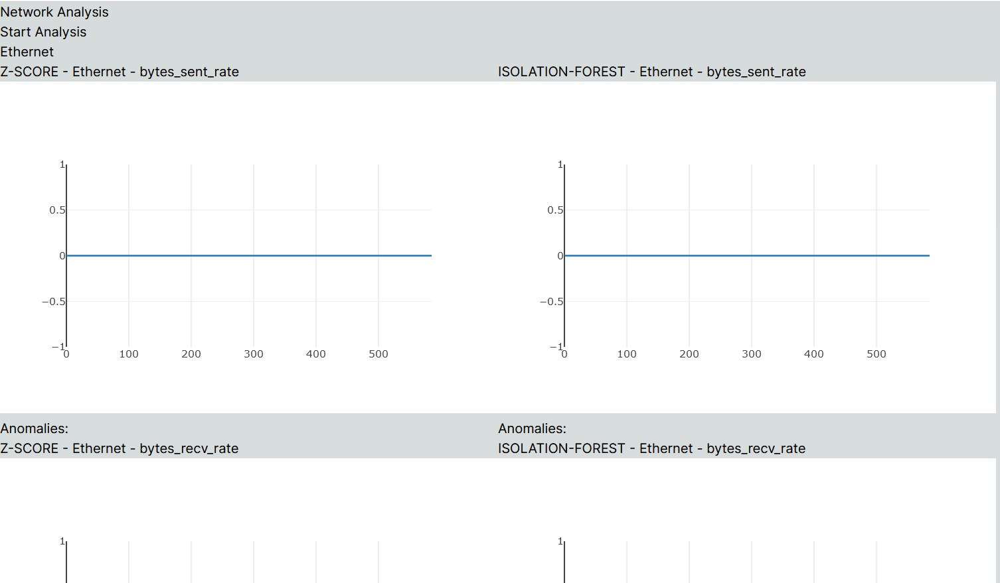
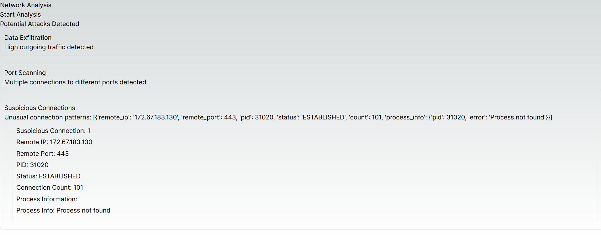

# Anomalies Detection

This repository contains a Flask server for anomalies detection.

## Setup

### Prerequisites

- Python 3.8
- Virtual Environment

### Installation

1. Create a virtual environment:
    ```
    python -m venv venv
    ```

2. Activate the virtual environment:
    ```
    venv\Scripts\activate
    ```

3. Install the required packages:
    ```
    pip install -r requirements.txt
    ```

## Usage

1. Start the Flask server:
    ```
    python app.py
    ```


2. The server will be running on `http://127.0.0.1:5000`.

## ScreenShots

1. Comparison of Z-Score and Isolation Forest


2. Detect Attack Type
